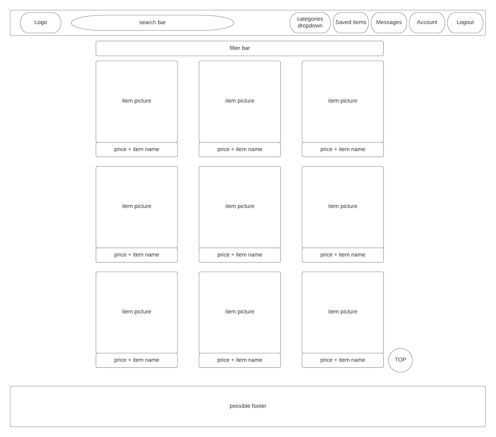
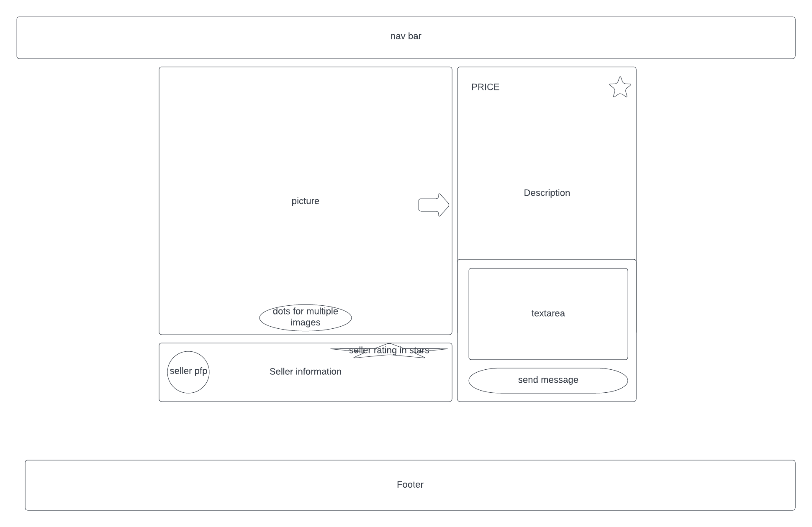
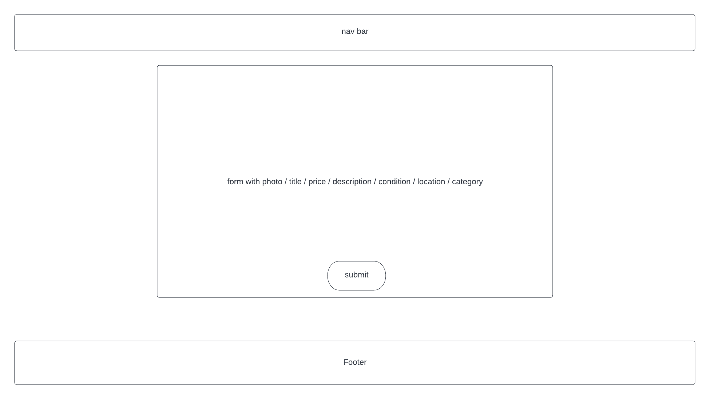
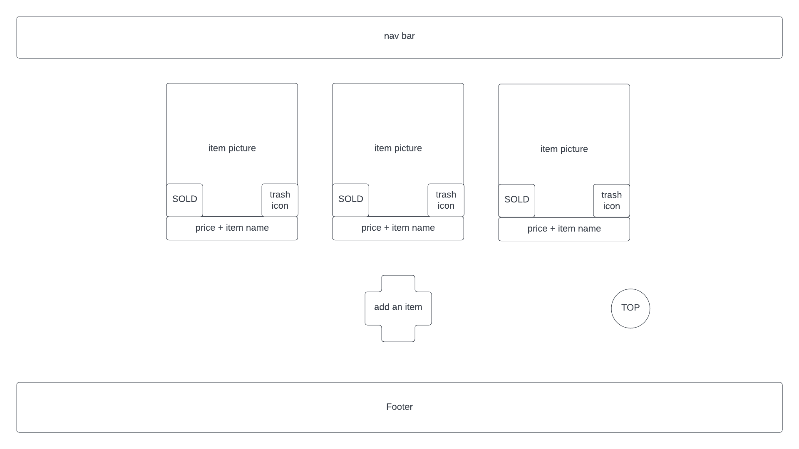

# User Story
<!-- describes how a user will interact with our app and why?
you get user stories from list of requirements.
As a user, I can _______, because _______

example: As a logged in user I want to see all the available maps because I want to quickly select a map that matches my interests.

example: As a user, I can favourite a blog post, because I want to review it later. -->

## Basic User Features
- As a user I can see featured items on a **main feed**

- As a user I can **filter** items by price + other search parameters (catergory etc.)

- As a user I can **favourite** items to check up on them later

- As a user I can send **messages** (text, phone or email) to the user that is listing the item

- As a user I can **add/remove** my items for sale

- As a user I can **mark items as SOLD!**

### STRETCH FEATURES:
- as a user i can **rate** sellers
- in-app inbox

## Admins Features:
- As an admin I can **remove ANY items** from the site

phone number only visible to logged in users
message box on item page will send email to seller

## WIREFRAMES
home page

item page

post item

my listings

saved items
